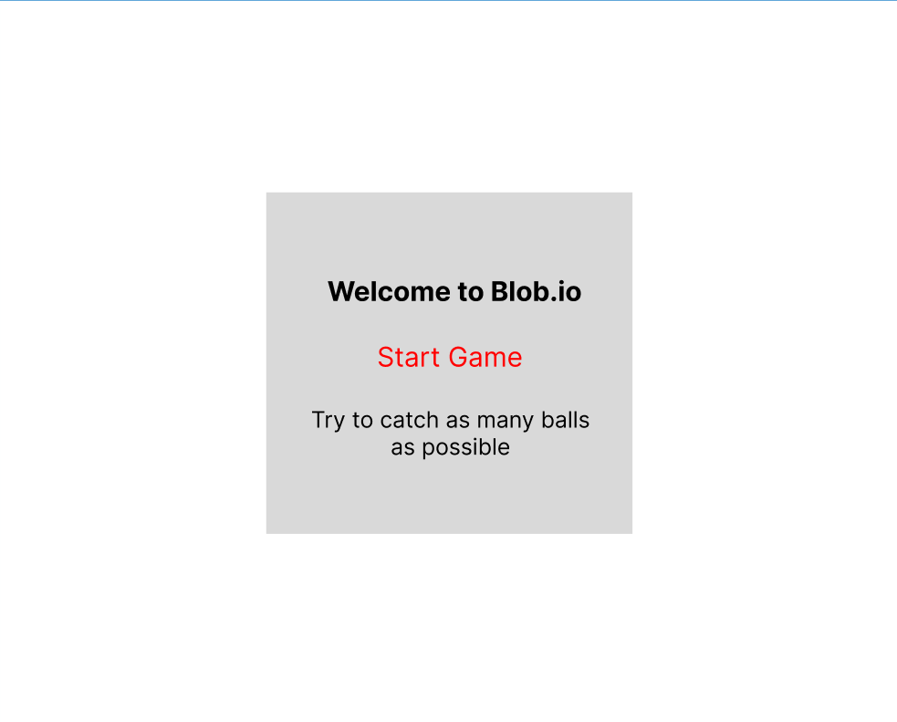
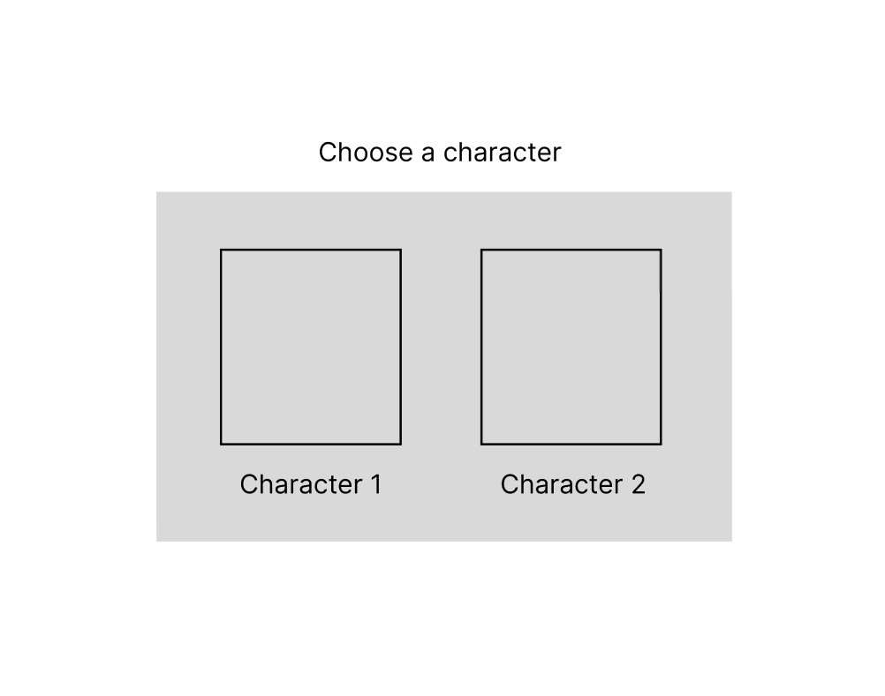
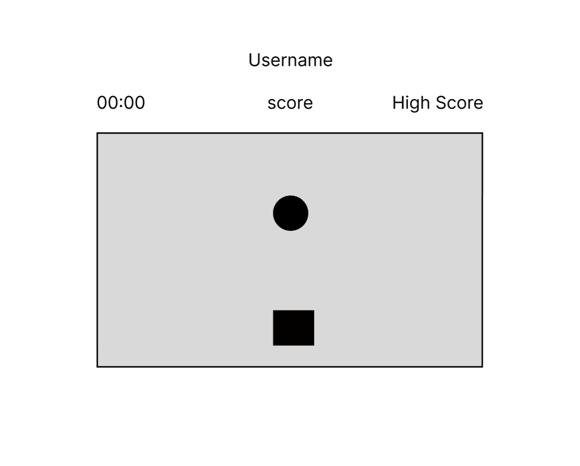
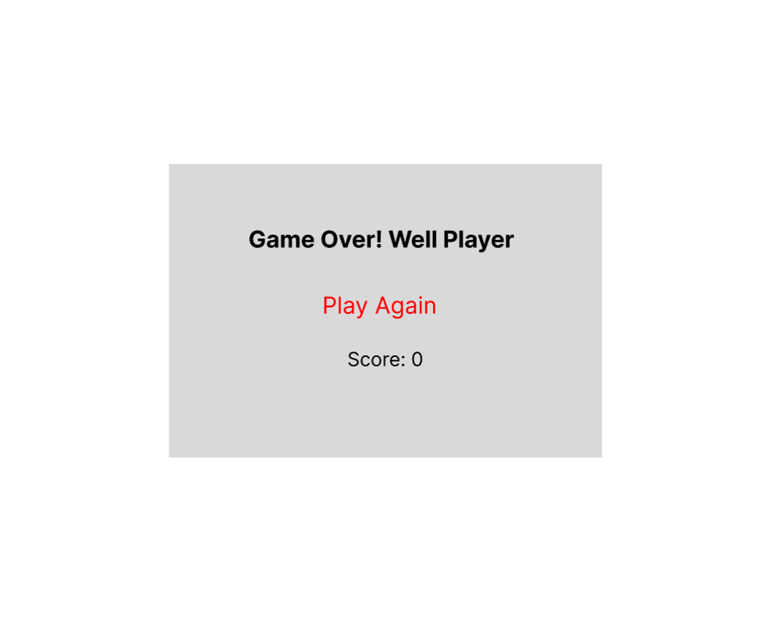

# Blob.io

# Date: 30/6/25

### By Alya Ahmed Alaali

---

[Linkedin](http://linkedin.com) |
[Github](http://Github.com) |
[Website](http://Website.com)

### _Description_

#### Blob.io is a single-player game where the user controls a character to eat as many (teleporting) balls as possible within a given time frame.

---

### _Technologies Used_

1. VSCode:

- for HTML, CSS and Javascript

2. Figma:

- creating key wireframes

3. procreate

- creating visuals and/or animation

---

### Pseudo-code

Upon opening the game, the user will be prompted to enter their preferred username and start a new game. After that, a character selection screen will appear, allowing the user to choose their preferred character. Next, the user will select a difficulty level: "Easy" means the ball teleports slower, while the speed increases with higher difficulty levels.

Once the selections are made, the game board will be displayed. The user can control their character using the arrow keys to catch as many balls as possible. A counter will keep track of the number of balls caught and compare it to the high score. When the time is up, the game will end, and the final score will be shown on the screen, along with the option to start a new game.

---

### WireFrames

#### Landing Page

#### Characters

#### Difficulty Level

#### Game Board

#### Game Over

