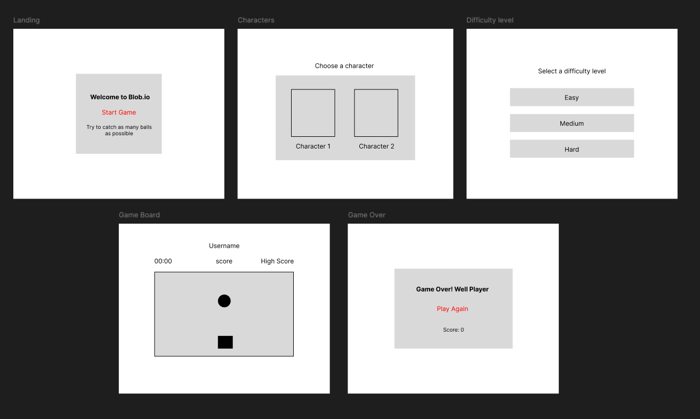

# Blob.io

# Date: 30/6/25

### By Alya Ahmed Alaali

---

[Linkedin](http://linkedin.com) |
[Github](http://Github.com) |
[Website](http://Website.com)

### _Description_

#### Blob.io is a single-player game where the user controls a character to eat as many (teleporting) balls as possible within a given time frame.

---

### _Technologies Used_

1. VSCode:

- for HTML, CSS and Javascript

2. Figma:

- creating key wireframes

3. procreate

- creating visuals and/or animation

---

### Pseudo-code

#### I will start by grabbing necessary HTML elements and setting up initial game variables like grid dimensions, player/ball positions, score, and game state. The makeGrid function will then generate the game board by creating square div elements and appending them to the grid container. The placeBall and placeSquare functions will handle positioning the ball and the user-controlled square on the grid. User input will be managed through the keyPress function, which updates the square's position based on arrow key presses. The checkOverlap function will determine if the square and ball collide, updating the score and repositioning the ball if they do. The startTimer function will initiate a countdown timer, ending the game when it reaches zero. The initiateGame function will start the timer, place the ball, and set up the ball to randomly teleport. The endGame function will stop the ball and timer, check for a new high score, store the final score, and redirect to the game over page. Finally, the createBoard function will call the functions to make the grid, place the square and print the highscore. 2 event listeners will be set up to start the game on spacebar press and to handle user input

---

### WireFrames

