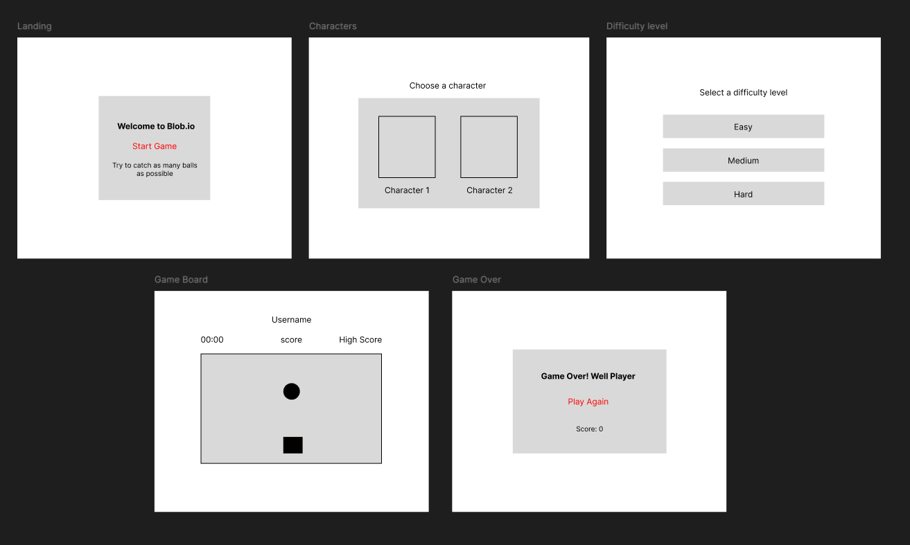

# Blob.io

# Date: 7/7/25

### By Alya Ahmed Alaali

---

[Linkedin](http://linkedin.com/in/alyaalaali3) |
[Github](http://Github.com/alyaalaali)

### _Description_

#### Blob is a silly game where you roam around a tropical island, and collect seashells before the clock hits zero.

### _Victory_

#### Winning requires finding the rare blue seashell, it has only a 2% chance of appearing on the board. Good luck!

#### You can play the game on:

[Blob.io](http://blobio.surge.sh)

---

### _Technologies Used_

- **Languages:** HTML, CSS, JavaScript
- **Graphics:** Aseprite (for visuals and animation)

---

### _WireFrames_



---

### _Setup and Functionality_

- Grab necessary HTML elements and set up initial game variables (grid dimensions, player/ball positions, score, game state).

- The `makeGrid` function generates the game board and appends square div elements to the grid container.

- The `placeBall` and placeSquare functions handle positioning the ball and user-controlled square on the grid.

- User input is managed through the `keyPress` function, updating the square's position based on arrow key presses.

- The `checkOverlap` function determines if the square and ball overlap, updating the score and repositioning the ball if they do.

- The `startTimer` function initiates a countdown timer that ends the game when it reaches zero.

- The `initiateGame` function starts the timer, places the ball, and sets up the ball to randomly teleport.

- The `endGame` function stops the ball and timer, checks for a new high score, stores the final score, and redirects to the game over page.

- The `createBoard` function calls functions to make the grid, place the square, and print the high score.

- Set up 2 event listeners to start the game on spacebar press and handle user input.

---

### _Favorite Function_

My favorite function is the `keyPress` function, which handles character movement. The simple implementation and the resulting silly character movements were very satisfying to create.

```js
const keyPress = (e) => {
  switch (e.key) {
    case keys.up:
      if (squarePosition.x > 0) {
        squarePosition.x--
      }
      character.src = gifs.back

      break
    case keys.down:
      if (squarePosition.x < 8) {
        squarePosition.x++
      }
      character.src = gifs.front
      break
    case keys.left:
      if (squarePosition.y > 0) {
        squarePosition.y--
      }
      character.src = gifs.left
      break
    case keys.right:
      if (squarePosition.y < 8) {
        squarePosition.y++
      }
      character.src = gifs.right
      break
  }
  updateSquare()
}
```

### _Unsolved Issues_

- **High Score Display:** The high score displays as NaN in Google Chrome.

### _Future Improvements_

- Adding sound effects and background music.
- adding different levels or game modes.

---

### _Attributions_

#### Sites that helped me complete the game

[W3school](https://www.w3schools.com/jsref/met_win_setinterval.asp)

[Stackoverflow](https://stackoverflow.com/questions/58162481/move-element-in-a-grid-layout-with-arrow-keys)
